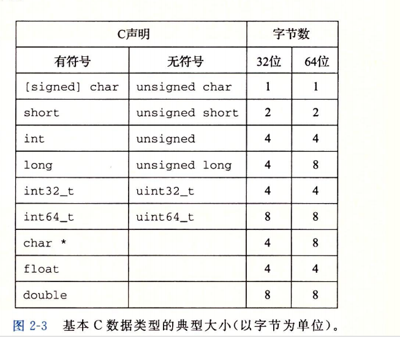

现代计算机存储和处理的信息以二值信号表示。这些微不足道的二进制数字，或者称 为位(bit),形成了数字革命的基础。大家熟悉并使用了 1000多年的十进制(以10为基数) 起源于印度，在12世纪被阿拉伯数学家改进，并在13世纪被意大利数学家Leonardo PisanoC大约公元1170—1250,更为大家所熟知的名字是Fibonacci)带到西方。对于有10 个手指的人类来说，使用十进制表示法是很自然的事情，但是当构造存储和处理信息的机 器时，二进制值工作得更好。二值信号能够很容易地被表示、存储和传输，例如，可以表 示为穿孔卡片上有洞或无洞、导线上的高电压或低电压，或者顺时针或逆时针的磁场。对 二值信号进行存储和执行计算的电子电路非常简单和可靠，制造商能够在一个单独的硅片 上集成数百万甚至数十亿个这样的电路。
孤立地讲，单个的位不是非常有用。然而，当把位组合在一起，再加上某种解释(inter¬pretation), 即赋予不同的可能位模式以含意，我们就能够表示任何有限集合的元素。比 如，使用一个二进制数字系统，我们能够用位组来编码非负数。通过使用标准的字符码， 我们能够对文档中的字母和符号进行编码。在本章中，我们将讨论这两种编码，以及负数 表示和实数近似值的编码。
我们研究三种最重要的数字表示。无符号(unsigned)编码基于传统的二进制表示法， 表示大于或者等于零的数字。补码(twoJs-complement)编码是表示有符号整数的最常见的 方式，有符号整数就是可以为正或者为负的数字。浮点数(floating-point)编码是表示实数 的科学记数法的以2为基数的版本。计算机用这些不同的表示方法实现算术运算，例如加 法和乘法，类似于对应的整数和实数运算。
计算机的表示法是用有限数量的位来对一个数字编码，因此，当结果太大以至不能表 示时，某些运算就会溢出(overflow) o溢出会导致某些令人吃惊的后果。例如，在今天的 大多数计算机上(使用32位来表示数据类型int),计算表达式200*300*400*500会得出结果 -884 901 8880这违背了整数运算的特性，计算一组正数的乘积不应产生一个负的结果。
另一方面，整数的计算机运算满足人们所熟知的真正整数运算的许多性质。例如，利 用乘法的结合律和交换律，计算下面任何一个C表达式，都会得出结果一884 901 888：
(500	* 400) *	(300 * 200)
((500	* 400) *	300) * 200
((200	* 500) *	300) * 400
400	* (200 *	(300 * 500))
计算机可能没有产生期望的结果，但是至少它是一致的！
浮点运算有完全不同的数学属性。虽然溢出会产生特殊的值+ 8,但是一组正数的乘 积总是正的。由于表示的精度有限，浮点运算是不可结合的。例如，在大多数机器上，C 表达式(3.14+le20)-le20求得的值会是0. 0,而3.14+ (le20-le20)求得的值会是3. 14。 整数运算和浮点数运算会有不同的数学属性是因为它们处理数字表示有限性的方式不 同一整数的表示虽然只能编码一个相对较小的数值范围，但是这种表示是精确的；而浮 点数虽然可以编码一个较大的数值范围，但是这种表示只是近似的。
通过研究数字的实际表示，我们能够了解可以表示的值的范围和不同算术运算的属 性。为了使编写的程序能在全部数值范围内正确工作，而且具有可以跨越不同机器、操作 系统和编译器组合的可移植性，了解这种属性是非常重要的。后面我们会讲到，大量计算 机的安全漏洞都是由于计算机算术运算的微妙细节引发的。在早期，当人们碰巧触发了程 序漏洞，只会给人们带来一些不便，但是现在，有众多的黑客企图利用他们能找到的任何 漏洞，不经过授权就进入他人的系统。这就要求程序员有更多的责任和义务，去了解他们 的程序如何工作，以及如何被迫产生不良的行为。
计算机用几种不同的二进制表示形式来编码数值。随着第3章进入机器级编程，你需 要熟悉这些表示方式。在本章中，我们描述这些编码，并且教你如何推出数字的表示。
通过直接操作数字的位级表示，我们得到了几种进行算术运算的方式。理解这些技术对 于理解编译器产生的机器级代码是很重要的，编译器会试图优化算术表达式求值的性能。
我们对这部分内容的处理是基于一组核心的数学原理的。从编码的基本定义开始，然 后得出一些属性，例如可表示的数字的范围、它们的位级表示以及算术运算的属性。我们 相信从这样一个抽象的观点来分析这些内容，对你来说是很重要的，因为程序员需要对计 算机运算与更为人熟悉的整数和实数运算之间的关系有清晰的理解。
* 信息存储
  大多数计算机使用8位的块，或者字节(byte),作为最小的可寻址的内存单位，而不 是访问内存中单独的位。机器级程序将内存视为一个非常大的字节数组，称为虚拟内存 (virtual memory) o内存的每个字节都由一个唯一的数字来标识，称为它的地址(ad- dress),所有可能地址的集合就称为虚拟地址空间(virtual address space) 0顾名思义，这 个虚拟地址空间只是一个展现给机器级程序的概念性映像。实际的实现(见第9章)是将动 态随机访问存储器(DRAM)、闪存、磁盘存储器、特殊硬件和操作系统软件结合起来，为 程序提供一个看上去统一的字节数组。
  在接下来的几章中，我们将讲述编译器和运行时系统是如何将存储器空间划分为更可 管理的单元，来存放不同的程序对象(program object),即程序数据、指令和控制信息。 可以用各种机制来分配和管理程序不同部分的存储。这种管理完全是在虚拟地址空间里完 成的。例如，C语言中一个指针的值(无论它指向一个整数、一个结构或是某个其他程序 对象)都是某个存储块的第一个字节的虚拟地址。C编译器还把每个指针和类型信息联系 起来，这样就可以根据指针值的类型，生成不同的机器级代码来访问存储在指针所指向位置 处的值。尽管C编译器维护着这个类型信息，但是它生成的实际机器级程序并不包含关于数 据类型的信息。每个程序对象可以简单地视为一个字节块，而程序本身就是一个字节序列。 
* 六进制表示法
  一个字节由8位组成。在二进制表示法中，它的值域是00 0 0 0 0 002~llllllll2o如果看 成十进制整数，它的值域就是O10~25510o两种符号表示法对于描述位模式来说都不是非常 方便。二进制表示法太冗长，而十进制表示法与位模式的互相转化很麻烦。替代的方法是, 以16为基数，或者叫做十六进制（hexadecimal）数，来表示位模式。十六进制（简写为“hex”） 使用数字'0'〜'9'以及字符'A'〜'F，来表示16个可能的值。图2-2展示了 16个十 六进制数字对应的十进制值和二进制值。用十六进制书写，一个字节的值域为00”〜FFi6。
  编写机器级程序的一个常见任务就是在位模式的十进制、二进制和十六进制表示之间 人工转换。二进制和十六进制之间的转换比较简单直接，因为可以一次执行一个十六进制 数字的转换。
* 字数据大小
  每台计算机都有一个字长(word size),指明指针数据的标称大小(nominal size).因为 虚拟地址是以这样的一个字来编码的，所以字长决定的最重要的系统参数就是虚拟地址空 间的最大大小。也就是说，对于一个字长为s位的机器而言，虚拟地址的范围为0~2* —1, 程序最多访问2-个字节。
  最近这些年，出现了大规模的从32位字长机器到64位字长机器的迁移。这种情况首先出 现在为大型科学和数据库应用设计的高端机器上，之后是台式机和笔记本电脑，最近则出现在 智能手机的处理器上。32位字长限制虚拟地址空间为4千兆字节(写作4GB),也就是说，刚刚 超过4X10。字节。扩展到64位字长使得虚拟地址空间为16EB,大约是1. 84X1019字节。
  程序称为“32位程序”或“64位程 序”时，区别在于该程序是如何编译的， 而不是其运行的机器类型。
  计算机和编译器支持多种不同方式编 码的数字格式，如不同长度的整数和浮点 数。比如，许多机器都有处理单个字节的 指令，也有处理表示为2字节、4字节或 者8字节整数的指令，还有些指令支持表 示为4字节和8字节的浮点数。
  C语言支持整数和浮点数的多种数据 格式。
  
  程序员应该力图使他们的程序在不同的机器和编译器上可移植。可移植性的一个方面就 是使程序对不同数据类型的确切大小不敏感。C语言标准对不同数据类型的数字范围设置了 下界（这点在后面还将讲到），但是却没有上界。因为从1980年左右到2010年左右，32位机 器和32位程序是主流的组合，许多程序的编写都假设为图2-3中32位程序的字节分配。随 着64位机器的日益普及，在将这些程序移植到新机器上时，许多隐藏的对字长的依赖性就 会显现出来，成为错误。比如，许多程序员假设一个声明为int类型的程序对象能被用来存储 一个指针。这在大多数32位的机器上能正常工作，但是在一台64位的机器上却会导致问题。