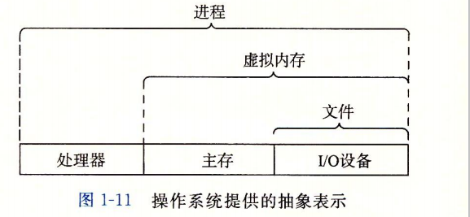
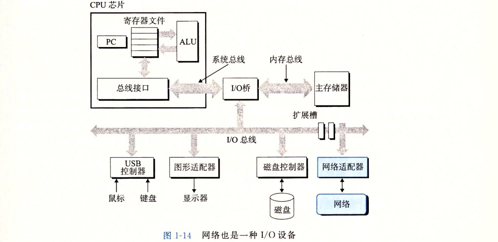

* 计算机系统是由硬件和系统软件组成的，它们共同工作来运行应用程序。虽然系统的 具体实现方式随着时间不断变化，但是系统内在的概念却没有改变。所有计算机系统都有 相似的硬件和软件组件，它们又执行着相似的功能。
```
#include <stdio.h>

int main() 
{
    printf("hello, world\n");
}
```
当你在系统上执行hello程序时，系统发生了什么以及为什么会这样。
* 信息就是位+上下文
  hell。程序的生命周期是从一个源程序（或者说源文件）开始的，即程序员通过编辑器创 建并保存的文本文件，文件名是hello.co源程序实际上就是一个由值。和1组成的位（又称 为比特）序列，8个位被组织成一组，称为字节。每个字节表示程序中的某些文本字符。
  大部分的现代计算机系统都使用ASCII标准来表示文本字符，这种方式实际上就是用 一个唯一的单字节大小的整数值°来表示每个字符。 hello.c程序是以字节序列的方式储存在文件中的。每个字节都有一个整数值.像hello.c这样只由ASCII字符构成 的文件称为文本文件，所有其他文件都称为二进制文件。
  hello.c的表示方法说明了一个基本思想：系统中所有的信息一一包括磁盘文件、内 存中的程序、内存中存放的用户数据以及网络上传送的数据，都是由一串比特表示的。区 分不同数据对象的唯一方法是我们读到这些数据对象时的上下文。比如，在不同的上下文 中，一个同样的字节序列可能表示一个整数、浮点数、字符串或者机器指令。
  作为程序员，我们需要了解数字的机器表示方式，因为它们与实际的整数和实数是不 同的。它们是对真值的有限近似值，有时候会有意想不到的行为表现。
* 程序被其他程序翻译成不同的格式
  hello程序的生命周期是从一个高级C语言程序开始的，因为这种形式能够被人读 懂。然而，为了在系统上运行hello.c程序，每条C语句都必须被其他程序转化为一系 列的低级机器语言指令。然后这些指令按照一种称为可执行目标程序的格式打好包，并以 二进制磁盘文件的形式存放起来。目标程序也称为可执行目标文件。
  在Unix系统上，从源文件到目标文件的转化是由编译器驱动程序完成的 `gcc -o hello hello.c` 在这里，GCC编译器驱动程序读取源程序文件hello.c,并把它翻译成一个可执行 目标文件hell。。这个翻译过程可分为四个阶段完成。执行这四个阶段的 程序（预处理器、编译器、汇编器和链接器）一起构成了编译系统（compilation system） 
  
  •预处理阶段。预处理器（cpp）根据以字符#开头的命令，修改原始的C程序。
  编译阶段。编译器（cel）将文本文件hello, i翻译成文本文件hello, s,它包含一 个汇编语言程序。
  汇编阶段。接下来，汇编器(as)将hello.s翻译成机器语言指令，把这些指令打包成 一种叫做可重定位目标程序(relocatable object program)的格式，并将结果保存在目标 文件hello.o中。hello.o文件是一个二进制文件
  链接阶段。请注意，hello程序调用了 printf函数，它是每个C编译器都提供的 标准C库中的一个函数。printf函数存在于一个名为printf .o的单独的预编译 好了的目标文件中，而这个文件必须以某种方式合并到我们的hello.0程序中。链 接器(Id)就负责处理这种合并。结果就得到hello文件，它是一个可执行目标文件 (或者简称为可执行文件)，可以被加载到内存中，由系统执行。
* 了解编译系统如何工作是大有益处的
优化程序性能。现代编译器都是成熟的工具，通常可以生成很好的代码。作为程序 员，我们无须为了写出高效代码而去了解编译器的内部工作。但是，为了在C程序中 做岀好的编码选择，我们确实需要了解一些机器代码以及编译器将不同的C语句转化 为机器代码的方式。比如，一个switch语句是否总是比一系列的if-else语句高效 得多？ 一个函数调用的开销有多大？ while循环比for循环更有效吗？指针引用比数 组索引更有效吗？为什么将循环求和的结果放到一个本地变量中，会比将其放到一个 通过引用传递过来的参数中，运行起来快很多呢？为什么我们只是简单地重新排列一 下算术表达式中的括号就能让函数运行得更快？
理解链接时出现的错误。根据我们的经验，一些最令人困扰的程序错误往往都与链 接器操作有关，尤其是当你试图构建大型的软件系统时。比如，链接器报告说它无 法解析一个引用，这是什么意思？静态变量和全局变量的区别是什么？如果你在不 同的C文件中定义了名字相同的两个全局变量会发生什么？静态库和动态库的区别 是什么？我们在命令行上排列库的顺序有什么影响？最严重的是，为什么有些链接 错误直到运行时才会出现？在第7章中，你将得到这些问题的答案。
•避免安全漏洞。多年来，缓冲区溢出错误是造成大多数网络和Internet服务器上安 全漏洞的主要原因。存在这些错误是因为很少有程序员能够理解需要限制从不受信 任的源接收数据的数量和格式。学习安全编程的第一步就是理解数据和控制信息存 储在程序栈上的方式会引起的后果。作为学习汇编语言的一部分，我们将在第3章 中描述堆栈原理和缓冲区溢出错误。我们还将学习程序员、编译器和操作系统可以 用来降低攻击威胁的方法。
* 处理器读并解释储存在内存中的指令
    此刻，hello.c源程序已经被编译系统翻译成了可执行目标文件hello,并被存放在 磁盘上。要想在Unix系统上运行该可执行文件，我们将它的文件名输入到称为shell的应 用程序中：
    linux> ./hello
    hello, world
    linux>
    shell是一个命令行解释器，它输出一个提示符，等待输入一个命令行，然后执行这 个命令。如果该命令行的第一个单词不是一个内置的shell命令，那么shell就会假设这是 一个可执行文件的名字，它将加载并运行这个文件。所以在此例中，shell将加载并运行 hello程序，然后等待程序终止。hello程序在屏幕上输出它的消息，然后终止。shell 随后输出一个提示符，等待下一个输入的命令行。
* 系统的硬件组成
    1.	总线
    贯穿整个系统的是一组电子管道，称作总线，它携带信息字节并负责在各个部件间传 递。通常总线被设计成传送定长的字节块，也就是字（word）。字中的字节数（即字长）是一 个基本的系统参数，各个系统中都不尽相同。现在的大多数机器字长要么是4个字节（32 位），要么是8个字节（64位）。本书中，我们不对字长做任何固定的假设。相反，我们将 '在需要明确定义的上下文中具体说明一个“字”是多大。
    2.	I/O设备
    1/0（输入/输出）设备是系统与外部世界的联系通道。我们的示例系统包括四个I/O设 备：作为用户输入的键盘和鼠标，作为用户输出的显示器，以及用于长期存储数据和程序 的磁盘驱动器（简单地说就是磁盘）。最开始，可执行程序hello就存放在磁盘上。
    每个I/O设备都通过一个控制器或适配器与I/O总线相连。控制器和适配器之间的区 别主要在于它们的封装方式。控制器是I/O设备本身或者系统的主印制电路板（通常称作 主板）上的芯片组。而适配器则是一块插在主板插槽上的卡。无论如何，它们的功能都是 在I/O总线和I/O设备之间传递信息。
    3.	主存
    主存是一个临时存储设备，在处理器执行程序时，用来存放程序和程序处理的数据。从 物理上来说，主存是由一组动态随机存取存储器（DRAM）芯片组成的。从逻辑上来说，存储 器是一个线性的字节数组，每个字节都有其唯一的地址（数组索引），这些地址是从零开始 的。一般来说，组成程序的每条机器指令都由不同数量的字节构成。与C程序变量相对应的 数据项的大小是根据类型变化的。比如，在运行Linux的x86-64机器上，short类型的数据 需要2个字节，int和float类型需要4个字节，而long和double类型需要8个字节。
    4.	处理器
    中央处理单元（CPU）,简称处理器，是解释（或执行）存储在主存中指令的引擎。处理 器的核心是一个大小为一个字的存储设备（或寄存器），称为程序计数器（PC）。在任何时 刻，PC都指向主存中的某条机器语言指令（即含有该条指令的地址）。e
    从系统通电开始，直到系统断电，处理器一直在不断地执行程序计数器指向的指令， 再更新程序计数器，使其指向下一条指令。处理器看上去是按照一个非常简单的指令执行 模型来操作的，这个模型是由指令集架构决定的。在这个模型中，指令按照严格的顺序执 行，而执行一条指令包含执行一系列的步骤。处理器从程序计数器指向的内存处读取指令，解释指令中的位，执行该指令指示的简单操作，然后更新PC,使其指向下一条指令， 而这条指令并不一定和在内存中刚刚执行的指令相邻。
  
  这样的简单操作并不多，它们围绕着主存、寄存器文件(register file)和算术/逻辑单 元(ALU)进行。寄存器文件是一个小的存储设备，由一些单个字长的寄存器组成，每个 寄存器都有唯一的名字。ALU计算新的数据和地址值。下面是一些简单操作的例子， CPU在指令的要求下可能会执行这些操作。
  •加载：从主存复制一个字节或者一个字到寄存器，以覆盖寄存器原来的内容。
  •存储：从寄存器复制一个字节或者一个字到主存的某个位置，以覆盖这个位置上原 来的内容。
  •操作：把两个寄存器的内容复制到ALU, ALU对这两个字做算术运算，并将结果 存放到一个寄存器中，以覆盖该寄存器中原来的内容。
  •跳转：从指令本身中抽取一个字，并将这个字复制到程序计数器(PC)中，以覆盖 PC中原来的值。
  处理器看上去是它的指令集架构的简单实现，但是实际上现代处理器使用了非常复杂 的机制来加速程序的执行。因此，我们将处理器的指令集架构和处理器的微体系结构区分 开来：指令集架构描述的是每条机器代码指令的效果；而微体系结构描述的是处理器实际 上是如何实现的。在第3章研究机器代码时，我们考虑的是机器的指令集架构所提供的抽 象性。第4章将更详细地介绍处理器实际上是如何实现的。
* 运行hell。程序
  初始时，shell程序执行它的指令，等待我们输入一个命令。当我们在键盘上输入字符串 "./hell。”后，shell程序将字符逐一读入寄存器，再把它存放到内存中
    
    当我们在键盘上敲回车键时，shell程序就知道我们已经结束了命令的输入。然后 shell执行一系列指令来加载可执行的hello文件，这些指令将hello目标文件中的代码 和数据从磁盘复制到主存。数据包括最终会被输出的字符串"hello, world\n\
    利用直接存储器存取（DMA,将在第6章中讨论）技术，数据可以不通过处理器而直 接从磁盘到达主存。
    
    一旦目标文件"丄丄。中的代码和数据被加载到主存，处理器就开始执行hello程序 的main程序中的机器语言指令。这些指令将“hell。，w°Hd\n”字符串中的字节从主存 复制到寄存器文件，再从寄存器文件中复制到显示设备，最终显示在屏幕上。
    
* 高速缓存至关重要
  这个简单的示例揭否了一个重要的问题，即系统花费了大量的时间把信息从一个地方 挪到另一个地方。hello程序的机器指令最初是存放在磁盘上，当程序加载时，它们被复 制到主存；当处理器运行程序时，指令又从主存复制到处理器。相似地，数据串“hel¬io, world/n"开始时在磁盘上，然后被复制到主存，最后从主存上复制到显示设备。从 程序员的角度来看，这些复制就是开销，减慢了程序“真正”的工作。因此，系统设计者 的一个主要目标就是使这些复制操作尽可能快地完成。
  根据机械原理，较大的存储设备要比较小的存储设备运行得慢，而快速设备的造价远高 于同类的低速设备。比如说，一个典型系统上的磁盘驱动器可能比主存大10。。倍，但是对 处理器而言，从磁盘驱动器上读取一个字的时间开销要比从主存中读取的开销大1000万倍。
  类似地，一个典型的寄存器文件只存储几百字节的信息，而主存里可存放几十亿字 节。然而，处理器从寄存器文件中读数据比从主存中读取几乎要快10。倍。更麻烦的是， 随着这些年半导体技术的进步，这种处理器与主存之间的差距还在持续增大。加快处理器 的运行速度比加快主存的运行速度要容易和便宜得多。
  针对这种处理器与主存之间的差异，系统设计者釆用了更小更快的存储设备，称为高 速缓存存储器（cache memory,简称为cache或高速缓存），作为暂时的集结区域，存放处 理器近期可能会需要的信息。图1-8展示了一个典型系统中的高速缓存存储器。位于处理 器芯片上的L1高速缓存的容量可以达到数万字节，访问速度几乎和访问寄存器文件一样 快。一个容量为数十万到数百万字节的更大的L2高速缓存通过一条特殊的总线连接到处 理器。进程访问L2高速缓存的时间要比访问L1高速缓存的时间长5倍，但是这仍然比访 问主存的时间快5~10倍。L1和L2高速缓存是用一种叫做静态随机访问存储器（SRAM） 的硬件技术实现的。比较新的、处理能力更强大的系统甚至有三级高速缓存：Ll、L2和 L3。系统可以获得一个很大的存储器，同时访问速度也很快，原因是利用了高速缓存的局 部性原理，即程序具有访问局部区域里的数据和代码的趋势。通过让高速缓存里存放可能 经常访问的数据，大部分的内存操作都能在快速的高速缓存中完成。
  
* 存储设备形成层次结构
  在处理器和一个较大较慢的设备（例如主存）之间插入一个更小更快的存储设备（例如 高速缓存）的想法已经成为一个普遍的观念。实际上，每个计算机系统中的存储设备都被 
  组织成了一个存储器层次结构，如图1-9所示。在这个层次结构中，从上至下，设备的访 问速度越来越慢、容量越来越大，并且每字节的造价也越来越便宜。寄存器文件在层次结 构中位于最顶部，也就是第。级或记为L0。这里我们展示的是三层高速缓存L1到L3, 占据存储器层次结构的第1层到第3层。主存在第4层，以此类推。
  
  储器层次结构的主要思想是上一层的存储器作为低一层存储器的高速缓存。因此, 寄存器文件就是L1的高速缓存，L1是L2的高速缓存，L2是L3的高速缓存，L3是主存 的高速缓存，而主存又是磁盘的高速缓存。在某些具有分布式文件系统的网络系统中，本 地磁盘就是存储在其他系统中磁盘上的数据的高速缓存。
* 操作系统管理硬件
  让我们回到hell。程序的例子。当shell加载和运行hell。程序时，以及hell。程序输 
  
  出自己的消息时，shell和hell。程序都没有 直接访问键盘、显示器、磁盘或者主存。取而 代之的是，它们依靠操作系统提供的服务。我 们可以把操作系统看成是应用程序和硬件之间 插入的一层软件，如图1-10所示。所有应用 程序对硬件的操作尝试都必须通过操作系统。
  操作系统有两个基本功能：（1）防止硬 件被失控的应用程序滥用；（2）向应用程序 提供简单一致的机制来控制复杂而又通常大 不相同的低级硬件设备。操作系统通过几个 基本的抽象概念（进程、虚拟内存和文件）来 实现这两个功能。如图1-11所示，文件是对I/O设备的抽象表示，虚拟内存是对主存和磁盘I/O设备的抽象表示，进程则是对处理 器、主存和I/O设备的抽象表示。我们将依次讨论每种抽象表示。


* 进程
  像hello这样的程序在现代系统上运行时，操作系统会提供一种假象，就好像系统上只 有这个程序在运行。程序看上去是独占地使用处理器、主存和I/。设备。处理器看上去就像 在不间断地一条接一条地执行程序中的指令，即该程序的代码和数据是系统内存中唯一的对 象。这些假象是通过进程的概念来实现的，进程是计算机科学中最重要和最成功的概念之一。
  进程是操作系统对一个正在运行的程序的一种抽象。在一个系统上可以同时运行多个 进程，而每个进程都好像在独占地使用硬件。而并发运行，则是说一个进程的指令和另一 个进程的指令是交错执行的。在大多数系统中，需要运行的进程数是多于可以运行它们的 CPU个数的。传统系统在一个时刻只能执行一个程序，而先进的多核处理器同时能够执 行多个程序。无论是在单核还是多核系统中，一个CPU看上去都像是在并发地执行多个 进程，这是通过处理器在进程间切换来实现的。操作系统实现这种交错执行的机制称为上 下文切换。为了简化讨论，我们只考虑包含一个CPU的单处理器系统的情况。我们会在 1. 9. 2节中讨论多处理器系统。 
  操作系统保持跟踪进程运行所需的所有状态信息。这种状态，也就是上下文，包括许 多信息，比如PC和寄存器文件的当前值，以及主存的内容。在任何一个时刻，单处理器 系统都只能执行一个进程的代码。当操作系统决定要把控制权从当前进程转移到某个新进 程时，就会进行上下文切换，即保存当前进程的上下文、恢复新进程的上下文，然后将控 制权传递到新进程。新进程就会从它上次停止的地方开始。图1-12展示了示例hello程 序运行场景的基本理念。
  示例场景中有两个并发的进程：shell进程和hello进程。最开始，只有shell进程在 运行，即等待命令行上的输入。当我们让它运行hello程序时，shell通过调用一个专门 的函数，即系统调用，来执行我们的请求，系统调用会将控制权传递给操作系统。操作系 统保存shell进程的上下文，创建一个新的hello进程及其上下文，然后将控制权传给新 的hello进程。hello进程终止后，操作系统恢复shell进程的上下文，并将控制权传回 给它，shell进程会继续等待下一个命令行输入。
  如图1-12所示，从一个进程到另一个进程的转换是由操作系统内核(kernel)管理的。 内核是操作系统代码常驻主存的部分。当应用程序需要操作系统的某些操作时，比如读写 文件，它就执行一条特殊的系统调用(system call)指令，将控制权传递给内核。然后内核 执行被请求的操作并返回应用程序。注意，内核不是一个独立的进程。相反，它是系统管 理全部进程所用代码和数据结构的集合。
  
  实现进程这个抽象概念需要低级硬件和操作系统软件之间的紧密合作。
* 线程
  尽管通常我们认为一个进程只有单一的控制流，但是在现代系统中，一个进程实际上 可以由多个称为线程的执行单元组成，每个线程都运行在进程的上下文中，并共享同样的 代码和全局数据。由于网络服务器中对并行处理的需求，线程成为越来越重要的编程模 型，因为多线程之间比多进程之间更容易共享数据，也因为线程一般来说都比进程更高 效。当有多处理器可用的时候，多线程也是一种使得程序可以运行得更快的方法
* 虚拟内存
  虚拟内存是一个抽象概念，它为每个进程提供了一个假象，即每个进程都在独占地使用 主存。每个进程看到的内存都是一致的，称为虚拟地址空间。图1-13所示的是Linux进程的 
  虚拟地址空间（其他Unix系统的设计也与此类似）。在Linux中，地址空间最上面的区域是 保留给操作系统中的代码和数据的，这对所有进程来说都是一样。地址空间的底部区域存放 用户进程定义的代码和数据。请注意，图中的地址是从下往上增大的。
  虚拟内存
  虚拟内存是一个抽象概念，它为每个进程提供了一个假象，即每个进程都在独占地使用 主存。每个进程看到的内存都是一致的，称为虚拟地址空间。图1-13所示的是Linux进程的 
  虚拟地址空间（其他Unix系统的设计也与此类似）。在Linux中，地址空间最上面的区域是 保留给操作系统中的代码和数据的，这对所有进程来说都是一样。地址空间的底部区域存放 用户进程定义的代码和数据。请注意，图中的地址是从下往上增大的。
  
* 文件
  文件就是字节序列，仅此而已。每个I/O设备，包括磁盘、键盘、显示器，甚至网 络，都可以看成是文件。系统中的所有输入输出都是通过使用一小组称为Unix 1/。的系 统函数调用读写文件来实现的。
  文件这个简单而精致的概念是非常强大的，因为它向应用程序提供了一个统一的视 图，来看待系统中可能含有的所有各式各样的I/O设备。例如，处理磁盘文件内容的应用 程序员可以非常幸福，因为他们无须了解具体的磁盘技术。进一步说，同一个程序可以在 使用不同磁盘技术的不同系统上运行。
* 系统之间利用网络通信
  系统漫游至此，我们一直是把系统视为一个孤立的硬件和软件的集合体。实际上，现 
  代系统经常通过网络和其他系统连接到一起。从一个单独的系统来看，网络可视为一个 I/。设备，如图1-14所示。当系统从主存复制一串字节到网络适配器时，数据流经过网络 到达另一台机器，而不是比如说到达本地磁盘驱动器。相似地，系统可以读取从其他机器 发送来的数据，并把数据复制到自己的主存。
  
  随着Internet这样的全球网络的出现，从一台主机复制信息到另外一台主机已经成为 计算机系统最重要的用途之一。比如，像电子邮件、即时通信、万维网、FTP和telnet这 样的应用都是基于网络复制信息的功能。
  回到hello示例，我们可以使用熟悉的telnet应用在一个远程主机上运行hello程 序。,假设用本地主机上的telnet客户端连接远程主机上的telnet服务器。在我们登录到远 程主机并运行shell后，远端的shell就在等待接收输入命令。此后在远端运行hell。程序 包括如图1-15所示的五个基本步骤。
  
  当我们在telnet客户端键入“hell。"字符串并敲下回车键后，客户端软件就会将这 个字符串发送到telnet的服务器。telnet服务器从网络上接收到这个字符串后，会把它传 递给远端shell程序。接下来，远端shell运行hello程序，并将输出行返回给telnet服务 器。最后，telnet服务器通过网络把输出串转发给telnet客户端，客户端就将输出串输出 到我们的本地终端上。
  这种客户端和服务器之间交互的类型在所有的网络应用中是非常典型的。在第11章 中，你将学会如何构造网络应用程序，并利用这些知识创建一个简单的Web服务器。
* 计算机系统中抽象的重要性
  抽象的使用是计算机科学中最为重要的概念之一。例如，为一组函数规定一个简单的 应用程序接口(API)就是一个很好的编程习惯，程序员无须了解它内部的工作便可以使用 这些代码。不同的编程语言提供不同形式和等级的抽象支持，例如Java类的声明和C语 言的函数原型。
  .我们已经介绍了计算机系统中使用的几个抽象，如图1-18所示。在处理器里，指令 集架构提供了对实际处理器硬件的抽象。使用这个抽象，机器代码程序表现得就好像运行 在一个一次只执行一条指令的处理器上。底层的硬件远比抽象描述的要复杂精细，它并行 地执行多条指令，但又总是与那个简单有序的模型保持一致。只要执行模型一样，不同的 处理器实现也能执行同样的机器代码，而又提供不同的开销和性能。
  
  在学习操作系统时，我们介绍了三个抽象：文件是对I/。设备的抽象，虚拟内存是对 程序存储器的抽象，而进程是对一个正在运行的程序的抽象。我们再增加一个新的抽象：  
  虚拟机，它提供对整个计算机的抽象，包括操作系统、处理器和程序。虚拟机的思想是 IBM在20世纪60年代提出来的，但是最近才显示出其管理计算机方式上的优势，因为一 些计算机必须能够运行为不同的操作系统(例如，Microsoft Windows、MacOS和Linux) 或同一操作系统的不同版本设计的程序。
* 小结
  计算机系统是由硬件和系统软件组成的，它们共同协作以运行应用程序。计算机内部的信息被表示 为一组组的位，它们依据上下文有不同的解释方式。程序被其他程序翻译成不同的形式，开始时是 ASCII文本，然后被编译器和链接器翻译成二进制可执行文件。
  处理器读取并解释存放在主存里的二进制指令。因为计算机花费了大量的时间在内存、I/O设备和 CPU寄存器之间复制数据，所以将系统中的存储设备划分成层次结构一一CPU寄存器在顶部，接着是多 层的硬件高速缓存存储器、DRAM主存和磁盘存储器。在层次模型中，位于更高层的存储设备比低层的 存储设备要更快，单位比特造价也更高。层次结构中较高层次的存储设备可以作为较低层次设备的高速 缓存。通过理解和运用这种存储层次结构的知识，程序员可以优化C程序的性能。
  操作系统内核是应用程序和硬件之间的媒介。它提供三个基本的抽象：1)文件是对I/O设备的抽琴； 2)虚拟内存是对主存和磁盘的抽象；3)进程是处理器、主存和I/O设备的抽象。
  最后，网络提供了计算机系统之间通信的手段。从特殊系统的角度来看，网络就是一种1/()设备。